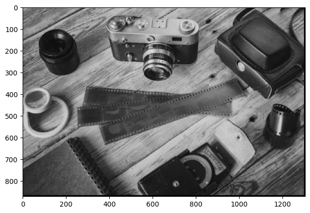

# Lab 5
This Lab will focus on applying filters.

## Filter/Kernel
A filter (or kernel) is a small matrix of numbers used to modify the pixels in an image. The filter is applied by sliding it across the image, performing a mathematical operation (typically convolution) between the filter and the image's pixel values. The result is a new image with altered pixel values.

### Steps:
1. create filter/kernel with an odd size.
2. Calculate padding needed for the desired filter.
3. Calculate the new image size.
4. Apply a sliding window algorithm on the image.
5. Calculate the dot product between filter/kernel and original image pixels.
6. The output value will be placed on the middle pixel of the filter/kernel.

#### Code: For 1D array.
```python
correlation_filterSize= 5
correlation_filter = np.array([1,2,5,7,8], dtype=np.uint8)
correlation_filter
```
Creating a 1D filter/kernel.

```python
correlation_newMatrixSize = zeroArray_5.size - correlation_filter.size + 1
correlation_newMatrix = np.zeros(correlation_newMatrixSize, dtype=np.uint8)
correlation_newMatrix
```
Create a new image variable with the new size to store product values.

```python
for i in range(correlation_newMatrixSize):
    correlation_newMatrix[i] = np.dot(zeroArray_5[i:i+correlation_filterSize], correlation_filter)
correlation_newMatrix
```
Use sliding algorithm to calculate each pixel value.

#### Code: For 2D array.
```python
correlation_2dMatrixSize_3 = (3,3)
correlation_2dMatrix_3 = np.zeros(correlation_2dMatrixSize_3, dtype=np.uint8)
correlation_2dMatrix_3[1,1] = 1
correlation_2dMatrix_3
```
Create image.

```python
correlation_2dPadding_3 = np.pad(correlation_2dMatrix_3, 2, mode='constant')
correlation_2dPadding_3
```
Apply padding.

```python
correlation_2dFilter_5 = np.random.randint(0, 10, (5,5), dtype=np.uint8)
correlation_2dFilter_5
```
Create filter.

```python
correlation_2dNewMatrix_3 = np.zeros(correlation_2dMatrixSize_3, dtype=np.uint8)

for i in range(correlation_2dMatrixSize_3[0]):
    for j in range(correlation_2dMatrixSize_3[1]):
        correlation_2dNewMatrix_3[i,j] = np.sum(correlation_2dPadding_3[i:i+correlation_filterSize, j:j+correlation_filterSize] * correlation_2dFilter_5)
correlation_2dNewMatrix_3
```
Use sliding window algorithm but in 2D.

## Blurring
Blurring is a common image processing technique used to reduce noise, smooth out detail, and decrease the sharpness of edges in an image. It involves applying a low-pass filter to the image, which removes high-frequency components (such as noise or fine details) while retaining the low-frequency components (such as large-scale gradients or structures).

### Code: standard blur
Average blur, also known as mean blur, is a simple image blurring technique used to reduce noise and smooth out detail in images. It operates by replacing each pixel's value with the average value of its neighboring pixels. This process effectively reduces high-frequency components in the image, resulting in a smoothed appearance.
```python 
averageFilter = np.ones((5,5))/25
averageFilter

> array([[0.04, 0.04, 0.04, 0.04, 0.04],
       [0.04, 0.04, 0.04, 0.04, 0.04],
       [0.04, 0.04, 0.04, 0.04, 0.04],
       [0.04, 0.04, 0.04, 0.04, 0.04],
       [0.04, 0.04, 0.04, 0.04, 0.04]])
```
Create a blurring filter called average blur or standard blur.

```python
imageCopyPadding = image.copy()
imageCopyPadding = np.pad(image, 2, mode='constant')
```
Copy image

```python
newImage = np.zeros(imageCopyPadding.shape)
for i in range(1, image.shape[0]):
    for j in range(1, image.shape[1]):
        newImage[i][j] = np.sum(imageCopyPadding[i:i+5, j:j+5]*averageFilter)
ski.io.imshow(newImage)
```
Use sliding window algorithm

Output:


### Code: Median
Median filtering is a digital image processing technique used to reduce noise in an image. Unlike other blurring techniques that use weighted averaging, median filtering replaces each pixel's value with the median value of its neighboring pixels. This approach is particularly effective at removing salt-and-pepper noise, where individual pixels in an image are either very bright or very dark compared to their neighbors.
```python
saltPepperImage = ski.io.imread(r"https://www.fit.vutbr.cz/~vasicek/imagedb/img_corrupted/impnoise_005/108073.png", as_gray=True)
ski.io.imshow(saltPepperImage)
```


```python
saltPepperImageCopyPadding = saltPepperImage.copy()
saltPepperImageCopyPadding = np.pad(saltPepperImage, 2, mode='constant')
```
Apply padding

```python
newSaltPepperImage = np.zeros(saltPepperImageCopyPadding.shape)

for i in range(saltPepperImage.shape[0]):
    for j in range(saltPepperImage.shape[1]):
        newSaltPepperImage[i][j] = np.median(saltPepperImageCopyPadding[i:i+3, j:j+3])
newSaltPepperImage = newSaltPepperImage[2:-2, 2:-2]

ski.io.imshow(newSaltPepperImage.astype(np.uint8))
```


See Lab 5 for more examples.